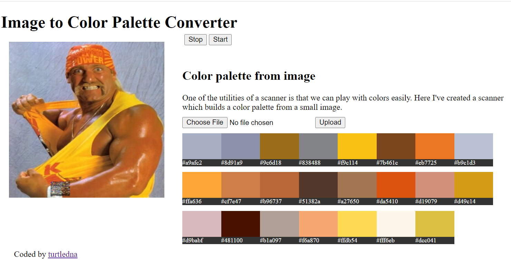

# Image to Color Palette v1.0
A demonstration of using [Borer](http://github.com/turtledna/borer) to sample an image into a color palette. Borer is an example of sequenced programming using turtle functions and sequences to read and alter data including images.
See http://turtledna.neocities.org/imagetocolorpalette/index.html for a working demo.

# About Borer
A small program called a borer runs on an image, and each number in an initial sequence relates to a function in something called the codex. The codex is a small library of functions. The borer moves around the image and performs tasks, which too can be installed into the codex. 

The complexity of the sequence and the image matter, and give different results. This is a starting example of the power of sequenced programming.

# To run
Download and extract first, then run index.html on Apache server or http://localhost. Built using Chrome.
